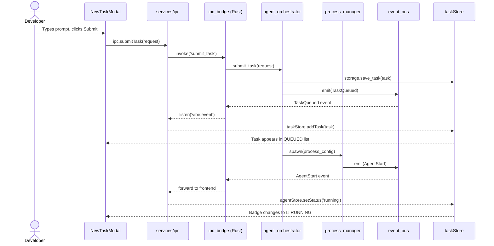
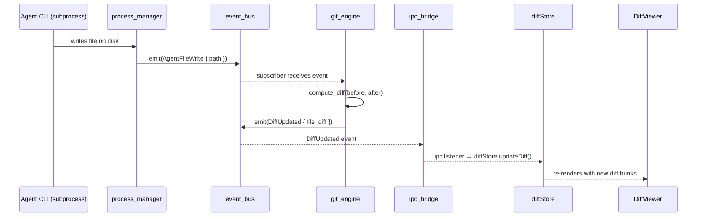

# Vibe Coding IDE — Architecture & Module Design

> **Version:** 1.0.0  
> **Status:** Draft  
> **Last Updated:** March 2026

---

## Table of Contents

1. [Architecture Principles](#architecture-principles)
2. [High-Level System Architecture](#high-level-system-architecture)
3. [Rust Backend — Module Design](#rust-backend--module-design)
   - [agent_orchestrator](#module-agent_orchestrator)
   - [process_manager](#module-process_manager)
   - [hook_runner](#module-hook_runner)
   - [git_engine](#module-git_engine)
   - [event_bus](#module-event_bus)
   - [storage](#module-storage)
   - [ipc_bridge](#module-ipc_bridge)
4. [Frontend — Module Design](#frontend--module-design)
   - [stores](#module-stores)
   - [features/terminal](#module-featuresterminal)
   - [features/diff-viewer](#module-featuresdiff-viewer)
   - [features/task-panel](#module-featurestask-panel)
   - [features/editor](#module-featureseditor)
   - [services/ipc](#module-servicesipc)
5. [Dependency Graph](#dependency-graph)
6. [Data Flow Diagrams](#data-flow-diagrams)
7. [Testing Strategy](#testing-strategy)
8. [Scalability Design](#scalability-design)
9. [Folder Structure](#folder-structure)

---

## Architecture Principles

Every module in Vibe Coding is designed around four non-negotiable properties:

| Principle | Definition | How we enforce it |
|-----------|-----------|-------------------|
| **Single Responsibility** | Each module owns exactly one concern | Modules cannot import sibling modules directly — only through interfaces |
| **Dependency Inversion** | High-level modules depend on abstractions, not implementations | Rust traits + TypeScript interfaces as contracts |
| **Testability** | Every module is testable in complete isolation | No singletons; all dependencies injected; side effects injectable |
| **Scalability** | Adding a new agent, language, or feature requires zero changes to existing modules | Plugin/registry pattern at every extension point |

---

## High-Level System Architecture

```
┌─────────────────────────────────────────────────────────────────────────────┐
│                          VIBE CODING IDE                                    │
│                                                                             │
│  ┌─────────────────────────────────────────────────────────────────────┐   │
│  │                        FRONTEND  (React 19 + TypeScript)            │   │
│  │                                                                     │   │
│  │  ┌──────────────┐  ┌──────────────┐  ┌────────────┐  ┌──────────┐ │   │
│  │  │   Terminal   │  │ Diff Viewer  │  │ Task Panel │  │  Editor  │ │   │
│  │  │   Feature    │  │   Feature    │  │  Feature   │  │  Feature │ │   │
│  │  └──────┬───────┘  └──────┬───────┘  └─────┬──────┘  └────┬─────┘ │   │
│  │         └─────────────────┴────────────┬────┘              │       │   │
│  │                                        │                   │       │   │
│  │  ┌─────────────────────────────────────▼───────────────────▼────┐  │   │
│  │  │                    STORES  (Zustand)                         │  │   │
│  │  │   agentStore │ taskStore │ diffStore │ terminalStore          │  │   │
│  │  └─────────────────────────────────────────────────────────────┘  │   │
│  │                                                                     │   │
│  │  ┌──────────────────────────────────────────────────────────────┐  │   │
│  │  │              IPC SERVICE  (Tauri event/command bridge)       │  │   │
│  │  └──────────────────────────────┬───────────────────────────────┘  │   │
│  └─────────────────────────────────┼───────────────────────────────────┘   │
│                                    │  Tauri IPC (Commands + Events)         │
│  ┌─────────────────────────────────▼───────────────────────────────────┐   │
│  │                        RUST BACKEND  (Tauri 2)                      │   │
│  │                                                                     │   │
│  │  ┌──────────────┐    ┌──────────────┐    ┌──────────────────────┐  │   │
│  │  │   IPC Bridge │    │  Event Bus   │    │   Storage (sqlx)     │  │   │
│  │  │  (Commands)  │    │  (tokio mpsc)│    │   SQLite WAL         │  │   │
│  │  └──────┬───────┘    └──────┬───────┘    └──────────────────────┘  │   │
│  │         │                   │                                       │   │
│  │  ┌──────▼───────────────────▼────────────────────────────────────┐ │   │
│  │  │                    CORE DOMAIN                                │ │   │
│  │  │                                                               │ │   │
│  │  │  ┌───────────────────┐    ┌──────────────┐  ┌─────────────┐  │ │   │
│  │  │  │ Agent Orchestrator│    │  Git Engine  │  │ Hook Runner │  │ │   │
│  │  │  └─────────┬─────────┘    └──────────────┘  └─────────────┘  │ │   │
│  │  │            │                                                  │ │   │
│  │  │  ┌─────────▼──────────┐                                      │ │   │
│  │  │  │  Process Manager   │                                      │ │   │
│  │  │  └────────────────────┘                                      │ │   │
│  │  └───────────────────────────────────────────────────────────────┘ │   │
│  └─────────────────────────────────────────────────────────────────────┘   │
│                                                                             │
│  ┌─────────────────────────────────────────────────────────────────────┐   │
│  │                        SIDECARS                                     │   │
│  │   Claude Code CLI │ Gemini CLI │ Goose CLI │ Bun (hook runner)      │   │
│  └─────────────────────────────────────────────────────────────────────┘   │
└─────────────────────────────────────────────────────────────────────────────┘
```

---

## Rust Backend — Module Design

### Module: `agent_orchestrator`

**Responsibility:** Owns the lifecycle of all agent tasks. Routes new tasks to the correct agent, manages the task queue, and coordinates start/end events. This is the only module allowed to create tasks.

**Does NOT:** Spawn processes (delegates to `process_manager`), execute hooks (delegates to `hook_runner`), or persist data (delegates to `storage`).

```rust
// src-tauri/src/agent_orchestrator/mod.rs

pub trait AgentOrchestrator: Send + Sync {
    async fn submit_task(&self, request: TaskRequest) -> Result<TaskId>;
    async fn cancel_task(&self, task_id: &TaskId) -> Result<()>;
    async fn get_running_tasks(&self) -> Vec<Task>;
    async fn get_queued_tasks(&self) -> Vec<Task>;
}

pub struct TaskRequest {
    pub agent: AgentKind,
    pub prompt: String,
    pub working_dir: PathBuf,
}

pub struct DefaultAgentOrchestrator {
    process_manager: Arc<dyn ProcessManager>,  // injected
    hook_runner:     Arc<dyn HookRunner>,      // injected
    storage:         Arc<dyn TaskStorage>,     // injected
    event_bus:       Arc<dyn EventBus>,        // injected
    queue:           Mutex<VecDeque<Task>>,
}

impl AgentOrchestrator for DefaultAgentOrchestrator {
    async fn submit_task(&self, request: TaskRequest) -> Result<TaskId> {
        let task = Task::new(request);
        self.storage.save_task(&task).await?;
        self.event_bus.emit(Event::TaskQueued(task.clone())).await?;

        if self.process_manager.is_agent_free(&task.agent).await {
            self.dispatch_task(task).await
        } else {
            self.queue.lock().unwrap().push_back(task.clone());
            Ok(task.id)
        }
    }
}
```

**Testability:** All four dependencies are traits — swap with mocks in tests.

```rust
// tests/agent_orchestrator_test.rs
#[tokio::test]
async fn test_task_queued_when_agent_busy() {
    let orchestrator = DefaultAgentOrchestrator {
        process_manager: Arc::new(MockProcessManager::busy()),
        hook_runner:     Arc::new(MockHookRunner::noop()),
        storage:         Arc::new(InMemoryTaskStorage::new()),
        event_bus:       Arc::new(RecordingEventBus::new()),
        queue:           Mutex::new(VecDeque::new()),
    };

    orchestrator.submit_task(fixture::task_request()).await.unwrap();

    assert_eq!(orchestrator.get_queued_tasks().await.len(), 1);
}
```

---

### Module: `process_manager`

**Responsibility:** Spawns and kills OS subprocesses for AI agents. Pipes stdout/stderr line-by-line to the event bus. Knows nothing about tasks or business logic — it only manages raw processes.

```rust
// src-tauri/src/process_manager/mod.rs

pub trait ProcessManager: Send + Sync {
    async fn spawn(&self, config: ProcessConfig) -> Result<ProcessHandle>;
    async fn kill(&self, handle: &ProcessHandle) -> Result<()>;
    async fn is_agent_free(&self, agent: &AgentKind) -> bool;
}

pub struct ProcessConfig {
    pub command:     String,
    pub args:        Vec<String>,
    pub working_dir: PathBuf,
    pub task_id:     TaskId,
    pub agent:       AgentKind,
}

pub struct TokioProcessManager {
    event_bus: Arc<dyn EventBus>,  // injected — only dependency
    handles:   Mutex<HashMap<TaskId, Child>>,
}

impl ProcessManager for TokioProcessManager {
    async fn spawn(&self, config: ProcessConfig) -> Result<ProcessHandle> {
        let mut child = Command::new(&config.command)
            .args(&config.args)
            .current_dir(&config.working_dir)
            .stdout(Stdio::piped())
            .stderr(Stdio::piped())
            .spawn()?;

        // Stream stdout to event bus
        let stdout = child.stdout.take().unwrap();
        let bus = self.event_bus.clone();
        let task_id = config.task_id.clone();
        let agent = config.agent.clone();

        tokio::spawn(async move {
            let mut lines = BufReader::new(stdout).lines();
            while let Some(line) = lines.next_line().await.unwrap_or(None) {
                bus.emit(Event::AgentOutput {
                    agent: agent.clone(),
                    task_id: task_id.clone(),
                    line,
                    stream: Stream::Stdout,
                }).await.ok();
            }
        });

        Ok(ProcessHandle::new(child.id()))
    }
}
```

**Testability:** `FakeProcessManager` replays fixture output lines without spawning real processes.

```rust
pub struct FakeProcessManager {
    pub fixture_lines: Vec<String>,
    pub event_bus: Arc<dyn EventBus>,
}
// Used in all integration tests — no real CLI needed
```

---

### Module: `hook_runner`

**Responsibility:** Executes user-defined JavaScript hooks from `.vibe/hooks.js` in a sandboxed Bun runtime. Receives hook events from the orchestrator and returns results asynchronously.

```rust
// src-tauri/src/hook_runner/mod.rs

pub trait HookRunner: Send + Sync {
    async fn run(&self, event: &HookEvent) -> Result<HookResult>;
    async fn load_hooks(&self, project_dir: &Path) -> Result<()>;
}

pub struct HookEvent {
    pub name:      String,          // "agent:start", "agent:end", etc.
    pub payload:   serde_json::Value,
    pub timeout:   Duration,
}

pub struct BunHookRunner {
    bun_bin:     PathBuf,           // path to embedded Bun sidecar (~50MB)
    hooks_path:  RwLock<Option<PathBuf>>,
}

impl HookRunner for BunHookRunner {
    async fn run(&self, event: &HookEvent) -> Result<HookResult> {
        let hooks_path = self.hooks_path.read().unwrap().clone();
        let Some(path) = hooks_path else {
            return Ok(HookResult::NoHook);
        };

        // Serialize event payload and call Bun sidecar
        // Bun starts in ~5ms vs Deno's ~100ms — critical for synchronous hooks
        let output = timeout(
            event.timeout,
            Command::new(&self.bun_bin)
                .args(["run", path.to_str().unwrap()])
                .env("VIBE_EVENT", serde_json::to_string(&event)?)
                .output()
        ).await??;

        Ok(HookResult::from_output(output))
    }
}

// NoopHookRunner for tests — never calls Bun
pub struct NoopHookRunner;
impl HookRunner for NoopHookRunner {
    async fn run(&self, _: &HookEvent) -> Result<HookResult> {
        Ok(HookResult::NoHook)
    }
}
```

---

### Module: `git_engine`

**Responsibility:** All git operations — computing diffs, staging hunks, committing. Uses `git2-rs` (libgit2). Never touches the task or agent system.

```rust
// src-tauri/src/git_engine/mod.rs

pub trait GitEngine: Send + Sync {
    async fn compute_diff(&self, repo: &Path, file: &Path) -> Result<FileDiff>;
    async fn stage_hunk(&self, repo: &Path, hunk: &DiffHunk) -> Result<()>;
    async fn unstage_hunk(&self, repo: &Path, hunk: &DiffHunk) -> Result<()>;
    async fn commit(&self, repo: &Path, message: &str) -> Result<CommitHash>;
    async fn get_pending_diffs(&self, repo: &Path) -> Result<Vec<FileDiff>>;
}

pub struct FileDiff {
    pub file_path:   PathBuf,
    pub hunks:       Vec<DiffHunk>,
    pub stats:       DiffStats,         // added/removed line counts
    pub agent:       Option<AgentKind>, // which agent caused this change
    pub task_id:     Option<TaskId>,
}

pub struct DiffHunk {
    pub id:          HunkId,
    pub header:      String,            // @@ -1,4 +1,6 @@
    pub lines:       Vec<DiffLine>,
    pub status:      HunkStatus,        // Pending | Accepted | Rejected
}

pub struct Libgit2Engine {
    // No dependencies — pure git2-rs calls
}

// In-memory engine for tests — no real git repo needed
pub struct InMemoryGitEngine {
    pub staged:    Mutex<Vec<DiffHunk>>,
    pub committed: Mutex<Vec<String>>,
}
```

---

### Module: `event_bus`

**Responsibility:** Decouple all modules from each other. Any module can emit an event; any module can subscribe. The only shared infrastructure all modules depend on.

```rust
// src-tauri/src/event_bus/mod.rs

pub trait EventBus: Send + Sync {
    async fn emit(&self, event: Event) -> Result<()>;
    fn subscribe(&self) -> broadcast::Receiver<Event>;
}

#[derive(Clone, Debug, Serialize, Deserialize)]
#[serde(tag = "type")]
pub enum Event {
    // Agent lifecycle
    AgentStart    { agent: AgentKind, task_id: TaskId, prompt: String },
    AgentEnd      { agent: AgentKind, task_id: TaskId, status: TaskStatus, duration_ms: u64 },
    AgentOutput   { agent: AgentKind, task_id: TaskId, line: String, stream: Stream },
    AgentFileWrite{ agent: AgentKind, task_id: TaskId, path: PathBuf },
    AgentCommand  { agent: AgentKind, task_id: TaskId, command: String },

    // Task lifecycle
    TaskQueued    { task: Task },
    TaskStarted   { task: Task },
    TaskCancelled { task_id: TaskId },

    // Diff lifecycle
    DiffUpdated   { file_path: PathBuf, diff: FileDiff },
    HunkAccepted  { hunk_id: HunkId },
    HunkRejected  { hunk_id: HunkId },

    // Hook lifecycle
    HookFired     { event_name: String, result: HookResult },
}

// Tokio broadcast-based real implementation
pub struct TokioBroadcastBus {
    sender: broadcast::Sender<Event>,
}

// In-memory recording bus for tests
pub struct RecordingEventBus {
    pub events: Mutex<Vec<Event>>,
}
impl EventBus for RecordingEventBus {
    async fn emit(&self, event: Event) -> Result<()> {
        self.events.lock().unwrap().push(event);
        Ok(())
    }
}
```

---

### Module: `storage`

**Responsibility:** Persist and query tasks, hook events, and diff snapshots using SQLite. Exposes typed async repository interfaces — no SQL leaks outside this module.

```rust
// src-tauri/src/storage/mod.rs

// Separate trait per aggregate — each testable independently
pub trait TaskStorage: Send + Sync {
    async fn save_task(&self, task: &Task) -> Result<()>;
    async fn update_task_status(&self, id: &TaskId, status: TaskStatus) -> Result<()>;
    async fn find_task(&self, id: &TaskId) -> Result<Option<Task>>;
    async fn list_tasks(&self, filter: TaskFilter) -> Result<Vec<Task>>;
    async fn search_tasks(&self, query: &str) -> Result<Vec<Task>>;
}

pub trait DiffStorage: Send + Sync {
    async fn save_diff(&self, diff: &FileDiff) -> Result<()>;
    async fn get_pending_diffs(&self, task_id: &TaskId) -> Result<Vec<FileDiff>>;
    async fn update_hunk_status(&self, hunk_id: &HunkId, status: HunkStatus) -> Result<()>;
}

pub trait HookEventStorage: Send + Sync {
    async fn save_hook_event(&self, event: &HookEventRecord) -> Result<()>;
    async fn list_events_for_task(&self, task_id: &TaskId) -> Result<Vec<HookEventRecord>>;
}

pub struct TaskFilter {
    pub agent:      Option<AgentKind>,
    pub status:     Option<TaskStatus>,
    pub after:      Option<DateTime<Utc>>,
    pub before:     Option<DateTime<Utc>>,
    pub limit:      usize,
    pub offset:     usize,
}

// SQLite implementations
pub struct SqliteTaskStorage    { pool: SqlitePool }
pub struct SqliteDiffStorage    { pool: SqlitePool }
pub struct SqliteHookStorage    { pool: SqlitePool }

// In-memory implementations for tests — no database needed
pub struct InMemoryTaskStorage  { tasks: Mutex<HashMap<TaskId, Task>> }
pub struct InMemoryDiffStorage  { diffs: Mutex<Vec<FileDiff>> }
```

---

### Module: `ipc_bridge`

**Responsibility:** The only module that touches Tauri directly. Translates Tauri commands into domain calls, and subscribes to the event bus to forward events to the WebView frontend. Thin adapter — zero business logic here.

```rust
// src-tauri/src/ipc_bridge/mod.rs

// ── Commands (Frontend → Rust) ──────────────────────────────────────────

#[tauri::command]
pub async fn submit_task(
    request: TaskRequestDto,
    orchestrator: State<Arc<dyn AgentOrchestrator>>,
) -> Result<String, String> {
    orchestrator
        .submit_task(request.into())
        .await
        .map(|id| id.to_string())
        .map_err(|e| e.to_string())
}

#[tauri::command]
pub async fn cancel_task(
    task_id: String,
    orchestrator: State<Arc<dyn AgentOrchestrator>>,
) -> Result<(), String> {
    orchestrator
        .cancel_task(&TaskId::from(task_id))
        .await
        .map_err(|e| e.to_string())
}

#[tauri::command]
pub async fn accept_hunk(
    hunk_id: String,
    git_engine: State<Arc<dyn GitEngine>>,
    storage: State<Arc<dyn DiffStorage>>,
) -> Result<(), String> { /* ... */ }

#[tauri::command]
pub async fn list_tasks(
    filter: TaskFilterDto,
    storage: State<Arc<dyn TaskStorage>>,
) -> Result<Vec<TaskDto>, String> { /* ... */ }

// ── Event Forwarder (Rust → Frontend) ────────────────────────────────────

pub async fn start_event_forwarder(
    app: AppHandle,
    event_bus: Arc<dyn EventBus>,
) {
    let mut rx = event_bus.subscribe();
    tokio::spawn(async move {
        while let Ok(event) = rx.recv().await {
            // Forward every domain event to the WebView
            app.emit("vibe:event", &event).ok();
        }
    });
}
```

---

## Frontend — Module Design

### Module: `stores`

**Responsibility:** Single source of truth for all UI state. Stores are updated exclusively by the IPC service — UI components only read from stores and dispatch actions.

```typescript
// src/stores/taskStore.ts
interface TaskStore {
  runningTasks:  Task[];
  queuedTasks:   Task[];
  
  // Actions
  addTask:         (task: Task) => void;
  updateStatus:    (taskId: string, status: TaskStatus) => void;
  moveToHistory:   (taskId: string) => void;
}

export const useTaskStore = create<TaskStore>()(
  immer((set) => ({
    runningTasks: [],
    queuedTasks:  [],

    addTask: (task) => set((state) => {
      if (task.status === 'queued') state.queuedTasks.push(task);
      else state.runningTasks.push(task);
    }),

    updateStatus: (taskId, status) => set((state) => {
      const task = state.runningTasks.find(t => t.id === taskId);
      if (task) task.status = status;
    }),
  }))
);

// src/stores/diffStore.ts
interface DiffStore {
  pendingDiffs:  Record<string, FileDiff>;   // keyed by file path
  acceptHunk:    (fileId: string, hunkId: string) => void;
  rejectHunk:    (fileId: string, hunkId: string) => void;
  updateDiff:    (diff: FileDiff) => void;
}

// src/stores/terminalStore.ts
interface TerminalStore {
  sessions:      Record<string, TerminalSession>;  // keyed by agent
  activeAgent:   string | null;
  appendLine:    (agent: string, line: string) => void;
  setActive:     (agent: string) => void;
}

// src/stores/agentStore.ts
interface AgentStore {
  agents:        Record<string, AgentState>;
  setAgentStatus:(agent: string, status: AgentStatus) => void;
}
```

**Testability:** Stores are plain Zustand objects — test them directly without rendering any component.

```typescript
// stores/__tests__/taskStore.test.ts
it('moves task from queued to running', () => {
  const { addTask, updateStatus, runningTasks } = useTaskStore.getState();
  addTask(fixture.queuedTask());
  updateStatus(fixture.queuedTask().id, 'running');
  expect(useTaskStore.getState().runningTasks).toHaveLength(1);
});
```

---

### Module: `features/terminal`

**Responsibility:** Renders the multiplexed Center Terminal using xterm.js. Subscribes to `terminalStore` only. Does NOT talk to IPC directly.

```
features/terminal/
  ├── CenterTerminal.tsx        ← Container: tab bar + active terminal pane
  ├── TerminalPane.tsx          ← Single xterm.js instance per agent
  ├── AgentTabBar.tsx           ← Tabs with agent status badges
  ├── TerminalFilterBar.tsx     ← Filter by agent / search
  ├── hooks/
  │   ├── useTerminalInstance.ts ← Creates + manages xterm.js lifecycle
  │   └── useTerminalScroll.ts  ← Auto-scroll logic
  └── __tests__/
      ├── CenterTerminal.test.tsx
      └── useTerminalInstance.test.ts
```

```typescript
// features/terminal/TerminalPane.tsx
// Pure: receives lines as props, renders xterm.js — no store access
interface TerminalPaneProps {
  agent:   string;
  lines:   string[];
  isActive: boolean;
}

export function TerminalPane({ agent, lines, isActive }: TerminalPaneProps) {
  const termRef = useRef<Terminal | null>(null);
  const containerRef = useRef<HTMLDivElement>(null);

  useTerminalInstance(containerRef, (term) => {
    termRef.current = term;
  });

  // Write new lines to xterm instance
  useEffect(() => {
    const last = lines.at(-1);
    if (last) termRef.current?.writeln(last);
  }, [lines]);

  return <div ref={containerRef} className="h-full w-full" hidden={!isActive} />;
}
```

---

### Module: `features/diff-viewer`

**Responsibility:** Renders file diffs, handles accept/reject interactions. Reads from `diffStore`, dispatches IPC calls on hunk actions.

```
features/diff-viewer/
  ├── DiffViewer.tsx            ← Container: file list + main diff pane
  ├── DiffFileList.tsx          ← Sidebar: list of changed files
  ├── DiffPane.tsx              ← Main split/unified diff renderer
  ├── HunkActions.tsx           ← Accept / Reject buttons per hunk
  ├── DiffFilterBar.tsx         ← Filter by agent / task
  ├── CommitPanel.tsx           ← Commit message + confirm button
  ├── hooks/
  │   ├── useDiffFilter.ts      ← Filter logic (pure function)
  │   └── useHunkActions.ts     ← Calls IPC, updates diffStore
  └── __tests__/
      ├── DiffPane.test.tsx
      ├── useDiffFilter.test.ts
      └── useHunkActions.test.ts
```

```typescript
// features/diff-viewer/hooks/useHunkActions.ts
// Thin hook — delegates to IPC, updates store
export function useHunkActions(fileId: string) {
  const acceptHunk = useDiffStore(s => s.acceptHunk);
  const rejectHunk = useDiffStore(s => s.rejectHunk);

  const accept = useCallback(async (hunkId: string) => {
    await ipc.acceptHunk(hunkId);       // Rust call
    acceptHunk(fileId, hunkId);         // Optimistic store update
  }, [fileId, acceptHunk]);

  const reject = useCallback(async (hunkId: string) => {
    await ipc.rejectHunk(hunkId);
    rejectHunk(fileId, hunkId);
  }, [fileId, rejectHunk]);

  return { accept, reject };
}
```

---

### Module: `features/task-panel`

**Responsibility:** Renders running, queued, and historical tasks. Provides search, filter, and re-run capabilities.

```
features/task-panel/
  ├── TaskPanel.tsx             ← Container: running + queued + history sections
  ├── TaskList.tsx              ← Virtualized list (TanStack Virtual)
  ├── TaskCard.tsx              ← Single task row with status badge
  ├── TaskDetailDrawer.tsx      ← Slide-out detail view
  ├── TaskFilterBar.tsx         ← Search + agent/status/date filters
  ├── NewTaskModal.tsx          ← Create + queue a new task
  ├── hooks/
  │   ├── useTaskSearch.ts      ← Fuse.js fuzzy search (pure)
  │   ├── useTaskFilter.ts      ← Filter logic (pure)
  │   └── useTaskActions.ts     ← Submit, cancel, re-run via IPC
  └── __tests__/
      ├── TaskCard.test.tsx
      ├── useTaskSearch.test.ts
      └── useTaskActions.test.ts
```

```typescript
// features/task-panel/hooks/useTaskSearch.ts
// Pure function — no side effects, easy to test
export function useTaskSearch(tasks: Task[], query: string): Task[] {
  return useMemo(() => {
    if (!query.trim()) return tasks;
    const fuse = new Fuse(tasks, {
      keys: ['prompt', 'agent', 'id'],
      threshold: 0.3,
    });
    return fuse.search(query).map(r => r.item);
  }, [tasks, query]);
}

// __tests__/useTaskSearch.test.ts
it('returns matching tasks by prompt', () => {
  const tasks = [fixture.task({ prompt: 'refactor auth' }), fixture.task({ prompt: 'fix css' })];
  const result = useTaskSearch(tasks, 'auth');
  expect(result).toHaveLength(1);
  expect(result[0].prompt).toBe('refactor auth');
});
```

---

### Module: `features/editor`

**Responsibility:** Wraps CodeMirror 6 for file editing. Stateless — receives file content as props, emits changes via callbacks.

```
features/editor/
  ├── CodeEditor.tsx            ← CodeMirror 6 wrapper component
  ├── EditorToolbar.tsx         ← Language selector, theme toggle
  ├── EditorStatusBar.tsx       ← Line/col, language, encoding
  ├── extensions/
  │   ├── agentHighlight.ts     ← Highlight lines changed by agents
  │   └── vibeTheme.ts          ← Custom dark theme
  └── __tests__/
      └── CodeEditor.test.tsx
```

---

### Module: `services/ipc`

**Responsibility:** Single gateway between the frontend and Rust backend. All Tauri `invoke` calls and `listen` subscriptions live here. Nothing else in the frontend calls Tauri directly.

```typescript
// src/services/ipc/index.ts

// ── Commands (Frontend → Rust) ───────────────────────────────────────────
export const ipc = {
  submitTask:   (req: TaskRequest)        => invoke<string>('submit_task', { request: req }),
  cancelTask:   (taskId: string)          => invoke<void>('cancel_task', { taskId }),
  acceptHunk:   (hunkId: string)          => invoke<void>('accept_hunk', { hunkId }),
  rejectHunk:   (hunkId: string)          => invoke<void>('reject_hunk', { hunkId }),
  commitDiff:   (message: string)         => invoke<string>('commit_diff', { message }),
  listTasks:    (filter: TaskFilter)      => invoke<Task[]>('list_tasks', { filter }),
  searchTasks:  (query: string)           => invoke<Task[]>('search_tasks', { query }),
  exportHistory:(format: ExportFormat)    => invoke<void>('export_history', { format }),
};

// ── Event Listener (Rust → Frontend) ────────────────────────────────────
export function startEventListener(store: VibeCodingStore): UnlistenFn {
  return listen<VibeEvent>('vibe:event', (event) => {
    const e = event.payload;
    switch (e.type) {
      case 'AgentStart':   store.agentStore.setStatus(e.agent, 'running'); break;
      case 'AgentEnd':     store.agentStore.setStatus(e.agent, 'idle');
                           store.taskStore.updateStatus(e.task_id, e.status); break;
      case 'AgentOutput':  store.terminalStore.appendLine(e.agent, e.line); break;
      case 'DiffUpdated':  store.diffStore.updateDiff(e.diff); break;
      case 'TaskQueued':   store.taskStore.addTask(e.task); break;
    }
  });
}

// ── Mock for tests ───────────────────────────────────────────────────────
export const mockIpc = {
  submitTask:  vi.fn().mockResolvedValue('task-001'),
  cancelTask:  vi.fn().mockResolvedValue(undefined),
  acceptHunk:  vi.fn().mockResolvedValue(undefined),
  // ...
};
```

**Testability:** Replace `ipc` with `mockIpc` in all component and hook tests — no Tauri runtime needed.

---

## Dependency Graph

```
                    ┌─────────────────────────────────────────────────────┐
                    │                RUST BACKEND                         │
                    │                                                     │
                    │   ipc_bridge                                        │
                    │       │                                             │
                    │       ├──► agent_orchestrator                       │
                    │       │       ├──► process_manager ──► event_bus    │
                    │       │       ├──► hook_runner                      │
                    │       │       ├──► storage (TaskStorage)            │
                    │       │       └──► event_bus                        │
                    │       ├──► git_engine                               │
                    │       │       └──► (no deps — pure libgit2)         │
                    │       └──► storage (DiffStorage, TaskStorage)       │
                    │                                                     │
                    │   event_bus ◄── (all modules emit to it)            │
                    │   event_bus ──► ipc_bridge ──► WebView frontend     │
                    └─────────────────────────────────────────────────────┘

                    ┌─────────────────────────────────────────────────────┐
                    │                FRONTEND                             │
                    │                                                     │
                    │   features/terminal ──► stores/terminalStore        │
                    │   features/diff-viewer──► stores/diffStore          │
                    │                      └──► services/ipc              │
                    │   features/task-panel ──► stores/taskStore          │
                    │                      └──► services/ipc              │
                    │   features/editor     ──► (stateless, no store)     │
                    │                                                     │
                    │   services/ipc ──► (Tauri invoke/listen only)       │
                    │   services/ipc ──► stores/* (on event receipt)      │
                    │                                                     │
                    │   RULE: features/* NEVER import each other          │
                    │   RULE: features/* NEVER call invoke() directly     │
                    │   RULE: stores/* NEVER import features/*            │
                    └─────────────────────────────────────────────────────┘
```

---

## Data Flow Diagrams

### Flow 1 — Developer submits a task



---

### Flow 2 — Agent writes a file → Diff appears



---

## Testing Strategy

### Backend Testing Pyramid

```
                    ┌──────────────────────┐
                    │   E2E Tests          │  Playwright + real Tauri app
                    │   (5–10 tests)       │  Slow, cover critical paths only
                    └──────────┬───────────┘
                    ┌──────────▼───────────┐
                    │   Integration Tests  │  Multiple real modules wired together
                    │   (30–50 tests)      │  Use InMemory storage + FakeProcess
                    └──────────┬───────────┘
                    ┌──────────▼───────────┐
                    │   Unit Tests         │  Single module, all deps mocked
                    │   (100–200 tests)    │  Fast (<1ms each), run on every save
                    └──────────────────────┘
```

**Key mock/fake implementations for Rust:**

| Real Module | Test Double | Used in |
|-------------|-------------|---------|
| `TokioProcessManager` | `FakeProcessManager` | Orchestrator unit tests |
| `SqliteTaskStorage` | `InMemoryTaskStorage` | All backend unit tests |
| `BunHookRunner` | `NoopHookRunner` | Process + orchestrator tests |
| `Libgit2Engine` | `InMemoryGitEngine` | Diff workflow tests |
| `TokioBroadcastBus` | `RecordingEventBus` | Verify events emitted correctly |

---

### Frontend Testing Pyramid

```
                    ┌──────────────────────┐
                    │   E2E Tests          │  Playwright — full app flows
                    │   (5–10 tests)       │
                    └──────────┬───────────┘
                    ┌──────────▼───────────┐
                    │   Component Tests    │  Vitest + React Testing Library
                    │   (50–80 tests)      │  mockIpc injected, stores pre-seeded
                    └──────────┬───────────┘
                    ┌──────────▼───────────┐
                    │   Hook / Store Tests │  Pure Vitest — no rendering
                    │   (80–120 tests)     │  useTaskSearch, useDiffFilter, stores
                    └──────────────────────┘
```

**Component test pattern:**

```typescript
// features/task-panel/__tests__/TaskCard.test.tsx
import { render, screen } from '@testing-library/react';
import { TaskCard } from '../TaskCard';
import { fixture } from '@/test/fixtures';

it('shows error badge when task status is error', () => {
  const task = fixture.task({ status: 'error' });
  render(<TaskCard task={task} onCancel={vi.fn()} onRerun={vi.fn()} />);
  expect(screen.getByText('ERROR')).toBeInTheDocument();
});

it('calls onCancel when cancel button clicked', async () => {
  const onCancel = vi.fn();
  const task = fixture.task({ status: 'running' });
  render(<TaskCard task={task} onCancel={onCancel} onRerun={vi.fn()} />);
  await userEvent.click(screen.getByRole('button', { name: /cancel/i }));
  expect(onCancel).toHaveBeenCalledWith(task.id);
});
```

---

## Scalability Design

### Adding a new AI Agent

Zero changes to existing modules. Only two files touched:

```
1. .vibe/config.json          → Add agent entry with command + color
2. src-tauri/src/agent_orchestrator/agent_registry.rs
                              → Register AgentKind::Custom("myagent")
```

The `ProcessManager`, `EventBus`, `Storage`, and all frontend modules work with any `AgentKind` automatically because they are parameterized on the type, not hardcoded.

---

### Adding a new Hook Event

```
1. event_bus/mod.rs           → Add variant to Event enum
2. ipc_bridge/mod.rs          → Forward new event to frontend
3. services/ipc/index.ts      → Handle new event type in switch
4. .vibe/hooks.js (user land) → Optionally handle the new event
```

No existing logic changes. Existing hooks that don't handle the new event simply ignore it.

---

### Adding a new Feature Panel (e.g., AI Chat)

```
1. src/features/chat/         → New self-contained feature module
2. src/stores/chatStore.ts    → New Zustand slice
3. services/ipc/index.ts      → Add new commands + event cases
4. src-tauri/src/ipc_bridge/  → Add new Tauri commands
5. src-tauri/src/chat_engine/ → New Rust module (if needed)
```

All existing feature modules are untouched. The new feature follows the same pattern — store + feature + IPC — and plugs into the existing event bus.

---

## Folder Structure

```
vibe-coding/
├── src/                            ← Frontend (React)
│   ├── features/
│   │   ├── terminal/
│   │   │   ├── CenterTerminal.tsx
│   │   │   ├── TerminalPane.tsx
│   │   │   ├── AgentTabBar.tsx
│   │   │   ├── hooks/
│   │   │   └── __tests__/
│   │   ├── diff-viewer/
│   │   │   ├── DiffViewer.tsx
│   │   │   ├── DiffPane.tsx
│   │   │   ├── HunkActions.tsx
│   │   │   ├── hooks/
│   │   │   └── __tests__/
│   │   ├── task-panel/
│   │   │   ├── TaskPanel.tsx
│   │   │   ├── TaskCard.tsx
│   │   │   ├── TaskDetailDrawer.tsx
│   │   │   ├── NewTaskModal.tsx
│   │   │   ├── hooks/
│   │   │   └── __tests__/
│   │   └── editor/
│   │       ├── CodeEditor.tsx
│   │       ├── extensions/
│   │       └── __tests__/
│   ├── stores/
│   │   ├── taskStore.ts
│   │   ├── diffStore.ts
│   │   ├── terminalStore.ts
│   │   ├── agentStore.ts
│   │   └── __tests__/
│   ├── services/
│   │   └── ipc/
│   │       ├── index.ts
│   │       ├── types.ts
│   │       └── mock.ts             ← mockIpc for tests
│   ├── test/
│   │   └── fixtures/               ← Shared test data factories
│   └── App.tsx
│
├── src-tauri/                      ← Rust Backend
│   ├── src/
│   │   ├── main.rs                 ← App bootstrap + DI wiring
│   │   ├── ipc_bridge/
│   │   │   ├── mod.rs
│   │   │   └── commands.rs
│   │   ├── agent_orchestrator/
│   │   │   ├── mod.rs
│   │   │   ├── agent_registry.rs
│   │   │   └── tests.rs
│   │   ├── process_manager/
│   │   │   ├── mod.rs
│   │   │   ├── fake.rs             ← FakeProcessManager
│   │   │   └── tests.rs
│   │   ├── hook_runner/
│   │   │   ├── mod.rs
│   │   │   ├── noop.rs             ← NoopHookRunner
│   │   │   └── tests.rs
│   │   ├── git_engine/
│   │   │   ├── mod.rs
│   │   │   ├── in_memory.rs        ← InMemoryGitEngine
│   │   │   └── tests.rs
│   │   ├── event_bus/
│   │   │   ├── mod.rs
│   │   │   └── recording.rs        ← RecordingEventBus
│   │   └── storage/
│   │       ├── mod.rs
│   │       ├── sqlite/
│   │       │   ├── task.rs
│   │       │   ├── diff.rs
│   │       │   └── hook_event.rs
│   │       ├── in_memory/          ← All InMemory implementations
│   │       └── migrations/         ← SQL migration files
│   └── Cargo.toml
│
├── .vibe/
│   ├── config.json
│   └── hooks.js
└── package.json
```

---

*Every module boundary in this architecture maps directly to an interface or trait. Adding, replacing, or testing any single piece requires touching only that module and its tests.*
