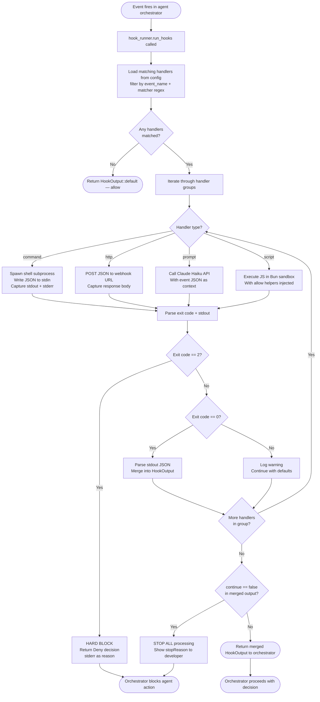

# Vibe Coding IDE — Hook System Design

> **Version:** 1.0.0  
> **Status:** Draft  
> **Last Updated:** March 2026  
> **References:** Claude Code Hooks (code.claude.com), Gemini CLI Hooks (geminicli.com/docs/hooks)

---

## Table of Contents

1. [Design Goals](#design-goals)
2. [Comparison: Claude Code vs Gemini CLI Hooks](#comparison-claude-code-vs-gemini-cli-hooks)
3. [Vibe Coding Unified Hook Model](#vibe-coding-unified-hook-model)
4. [Hook Events Reference](#hook-events-reference)
5. [Handler Types](#handler-types)
6. [Communication Protocol](#communication-protocol)
7. [Configuration Schema](#configuration-schema)
8. [Hook Execution Engine (Rust)](#hook-execution-engine-rust)
9. [Built-in Hook Examples](#built-in-hook-examples)
10. [Security Model](#security-model)
11. [Testing Hooks](#testing-hooks)

---

## Design Goals

Vibe Coding orchestrates **multiple AI agents simultaneously** (Claude Code, Gemini CLI, Goose CLI). Each agent has its own native hook system with different models, schemas, and protocols. The goal of Vibe Coding's hook system is to:

1. **Unify** all agent hook events under one consistent interface regardless of which agent fired them
2. **Extend** beyond what either agent natively exposes — add IDE-level events (diff accepted, task panel actions, session start)
3. **Normalize** the protocol so hook scripts written once work across all agents
4. **Intercept** native agent hooks before they reach the agent, giving Vibe Coding central control over allow/deny decisions
5. **Stay compatible** — Claude Code and Gemini CLI hook scripts can be reused in Vibe Coding with minimal or no changes

---

## Comparison: Claude Code vs Gemini CLI Hooks

Understanding both systems deeply is the foundation of the unified design.

### Event Coverage

| Event Category | Claude Code | Gemini CLI | Notes |
|---|---|---|---|
| Before tool executes | `PreToolUse` | `BeforeTool` | Same concept, different names |
| After tool executes | `PostToolUse` | `AfterTool` | Same concept |
| Before model call | ❌ | `BeforeModel` | Gemini-only |
| After model response | ❌ | `AfterModel` | Gemini-only |
| Session starts | `SessionStart` | `SessionStart` | Both support it |
| Session ends | `SessionEnd` | `SessionEnd` | Both support it |
| Before agent turn | ❌ | `BeforeAgent` | Gemini-only |
| After agent turn | `Stop` | `AfterAgent` | Different semantics |
| Subagent stops | `SubagentStop` | ❌ | Claude Code only |
| Notification | `Notification` | `Notification` | Both support it |
| Tool selection | ❌ | `BeforeToolSelection` | Gemini-only |
| Context compression | ❌ | `PreCompress` | Gemini-only |
| Permission request | `PermissionRequest` | ❌ | Claude Code only |
| User prompt submitted | `UserPromptSubmit` | ❌ | Claude Code only |

### Protocol Differences

| Aspect | Claude Code | Gemini CLI |
|---|---|---|
| **Input delivery** | JSON via `stdin` | JSON via `stdin` |
| **Output channel** | `stdout` (JSON) + exit code | `stdout` (JSON) + exit code |
| **Exit code 0** | Success, continue | Success, continue |
| **Exit code 2** | Hard block — stderr shown to agent | Critical block — stderr as reason |
| **Other non-zero** | Non-blocking warning | Warning, interaction proceeds |
| **Blocking a tool** | `permissionDecision: "deny"` in stdout JSON | `decision: "deny"` in stdout JSON |
| **Modifying tool input** | `updatedInput` field in stdout JSON | Not supported |
| **Adding context** | `additionalContext` field | `systemMessage` field |
| **Matchers** | Regex on tool name | Regex for tools, exact string for lifecycle |
| **Async hooks** | ✅ Supported (fire-and-forget) | ❌ All hooks are synchronous |
| **Hook types** | `command`, `prompt`, `agent`, `http` | `command` only |
| **Config location** | `.claude/settings.json` | `.gemini/settings.json` |
| **Timeout** | 10 minutes default | 60 seconds default |

### Key Design Insights

From studying both systems:

- **Claude Code is richer** in hook types (prompt, agent, http) and has more granular control fields (`updatedInput`, `permissionDecision`, `continue`, `suppressOutput`)
- **Gemini CLI is richer** in lifecycle events — it exposes model-level events (`BeforeModel`, `AfterModel`) that Claude Code doesn't
- **Both use stdin/stdout JSON + exit codes** — this is the right protocol to standardize on
- **Exit code 2 = hard block** in both systems — this is the universal signal
- **Matchers are regex in both** for tool events — Vibe Coding should adopt this
- **Claude Code's `updatedInput`** (modify tool params before execution) is a powerful feature worth adopting universally

---

## Vibe Coding Unified Hook Model

Vibe Coding introduces a **three-layer hook architecture**:

```
┌─────────────────────────────────────────────────────────────────────┐
│                    VIBE CODING HOOK LAYERS                          │
│                                                                     │
│  Layer 3: IDE-Level Hooks  (Vibe Coding native events)             │
│  ──────────────────────────────────────────────────────            │
│  DiffAccepted, DiffRejected, TaskQueued, TaskCancelled,            │
│  EditorFileSaved, SessionStart, SessionEnd                          │
│                                                                     │
│  Layer 2: Unified Agent Hooks  (normalized across all agents)      │
│  ──────────────────────────────────────────────────────            │
│  PreToolUse, PostToolUse, BeforeModel, AfterModel,                 │
│  AgentTurnStart, AgentTurnEnd, Notification                        │
│  (same schema regardless of which agent fires them)                 │
│                                                                     │
│  Layer 1: Native Pass-Through  (agent's own hook config)           │
│  ──────────────────────────────────────────────────────            │
│  .claude/settings.json hooks → forwarded to Vibe bus               │
│  .gemini/settings.json hooks → forwarded to Vibe bus               │
│  Vibe intercepts before forwarding to the agent                     │
└─────────────────────────────────────────────────────────────────────┘
```

Vibe Coding **wraps each agent process** and intercepts its stdin/stdout. When Claude Code or Gemini CLI fires a native hook, Vibe Coding:
1. Receives it first
2. Runs any matching Vibe-level hooks
3. If not blocked, forwards to the agent's own hook scripts
4. Returns the merged result back to the agent

---

## Hook Events Reference

### Unified Agent Events (Layer 2)

| Event | Fires When | Can Block? | Input Fields | Output Control |
|---|---|---|---|---|
| `PreToolUse` | Before any agent tool call | ✅ Yes | `agent`, `tool_name`, `tool_input`, `task_id` | `allow`, `deny`, `ask`, `updatedInput` |
| `PostToolUse` | After any agent tool call | ⚠️ Soft (add context) | `agent`, `tool_name`, `tool_input`, `tool_output`, `task_id` | `additionalContext`, `block` |
| `BeforeModel` | Before LLM API call | ✅ Yes | `agent`, `task_id`, `messages`, `model` | `allow`, `deny`, `mockResponse` |
| `AfterModel` | After LLM response received | ✅ Redact | `agent`, `task_id`, `response`, `model` | `allow`, `redact`, `block` |
| `AgentTurnStart` | Agent starts processing a prompt | ℹ️ Advisory | `agent`, `task_id`, `prompt` | `additionalContext` |
| `AgentTurnEnd` | Agent finishes its turn | ✅ Retry | `agent`, `task_id`, `status`, `duration_ms` | `allow`, `retry`, `halt` |
| `Notification` | Agent sends a notification | ℹ️ Advisory | `agent`, `task_id`, `message`, `level` | — |
| `PermissionRequest` | Agent requests elevated permission | ✅ Yes | `agent`, `task_id`, `permission`, `reason` | `approve`, `deny` |

### IDE-Level Events (Layer 3)

| Event | Fires When | Can Block? | Input Fields |
|---|---|---|---|
| `SessionStart` | Vibe Coding IDE session opens | ℹ️ Advisory | `session_id`, `project_dir`, `active_agents` |
| `SessionEnd` | Vibe Coding IDE session closes | ℹ️ Advisory | `session_id`, `task_count`, `duration_ms` |
| `TaskQueued` | Developer queues a new task | ✅ Yes (cancel queue) | `task_id`, `agent`, `prompt` |
| `TaskStarted` | Task moves from queue to running | ℹ️ Advisory | `task_id`, `agent`, `prompt` |
| `TaskCancelled` | Developer or hook cancels a task | ℹ️ Advisory | `task_id`, `agent`, `reason` |
| `DiffAccepted` | Developer accepts a diff hunk | ℹ️ Advisory | `task_id`, `agent`, `file_path`, `hunk_id` |
| `DiffRejected` | Developer rejects a diff hunk | ℹ️ Advisory | `task_id`, `agent`, `file_path`, `hunk_id` |
| `BeforeCommit` | Before staging and committing diffs | ✅ Yes | `task_id`, `agent`, `files`, `message` |
| `AfterCommit` | After a successful git commit | ℹ️ Advisory | `task_id`, `commit_hash`, `files` |
| `EditorFileSaved` | Developer saves a file in the editor | ℹ️ Advisory | `file_path`, `language` |

---

## Handler Types

Vibe Coding supports four handler types, combining the best of both reference systems.

### Type 1: `command` — Shell Script Handler

The default and most common type. Receives JSON via `stdin`, returns results via exit code and `stdout`.

```json
{
  "type": "command",
  "command": ".vibe/hooks/security-check.sh",
  "timeout": 5000
}
```

**Compatible with:** Claude Code command hooks, Gemini CLI command hooks. Scripts from either system can be reused directly.

---

### Type 2: `http` — Webhook Handler

Posts the event JSON to an HTTP endpoint. Useful for integrations with Slack, CI systems, audit services, or remote validators.

```json
{
  "type": "http",
  "url": "https://your-ci.example.com/hooks/vibe",
  "method": "POST",
  "headers": { "Authorization": "Bearer ${VIBE_WEBHOOK_TOKEN}" },
  "timeout": 3000
}
```

The endpoint receives the same JSON payload as a `command` hook receives on `stdin`. The HTTP response body is parsed as JSON using the same output schema.

---

### Type 3: `prompt` — LLM Judgment Handler

Sends the event data to a fast Claude model (Haiku) for semantic yes/no evaluation. No shell scripting required. Use `$ARGUMENTS` as a placeholder for the event JSON.

```json
{
  "type": "prompt",
  "model": "claude-haiku-4-5",
  "prompt": "Review this tool call: $ARGUMENTS. If it modifies authentication, payments, or security-related files, respond DENY. Otherwise respond ALLOW.",
  "timeout": 8000
}
```

The model returns a structured JSON decision. Best for semantic checks that are hard to express in regex or shell logic.

---

### Type 4: `script` — Inline JavaScript Handler

Execute an inline JavaScript function directly in the Bun sandbox — no external file needed. Ideal for simple transformations or validations.

```json
{
  "type": "script",
  "language": "javascript",
  "code": "const { tool_name, tool_input } = input; if (tool_input?.file_path?.includes('.env')) { exit(2, 'Blocked: .env modification not allowed'); } allow();"
}
```

The script receives the event as `input` and has access to `allow()`, `deny(reason)`, `exit(code, message)`, and `addContext(text)` helpers.

**Why Bun for the script runtime:**

| Aspect | Bun | Deno |
|---|---|---|
| **Startup time** | ~5ms | ~60–120ms |
| **npm compatibility** | ✅ Full — runs `npm` packages natively | ⚠️ Requires `npm:` prefix, not all packages work |
| **TypeScript** | ✅ Native, zero config | ✅ Native |
| **Binary size** | ~50MB single binary | ~80MB single binary |
| **Node.js API compat** | ✅ Near-complete `node:` builtins | ⚠️ Partial |
| **stdin/stdout** | `process.stdin` — identical to Node | Custom `Deno.stdin` API |
| **Permission model** | Process-level isolation via Tauri | Fine-grained `--allow-*` flags |
| **Hook script reuse** | Any Node.js script works unchanged | Requires migration from `node:` APIs |

Bun's **near-zero startup time (~5ms vs Deno's ~100ms)** is decisive here — hooks run synchronously and block the agent loop, so every millisecond matters. A `PreToolUse` hook that runs 50 times per task would add 5 seconds of latency with Deno startup overhead vs. ~250ms with Bun.

---

## Communication Protocol

All handler types share the same input/output JSON protocol.

### Input Schema (stdin / POST body)

Every hook event delivers this JSON structure:

```typescript
interface HookInput {
  // ── Common fields (all events) ──────────────────────────────────
  vibe_version:     string;           // "1.0.0"
  session_id:       string;           // Unique IDE session ID
  hook_event_name:  string;           // "PreToolUse", "DiffAccepted", etc.
  timestamp:        string;           // ISO 8601
  project_dir:      string;           // Absolute path to project root
  cwd:              string;           // Current working directory

  // ── Agent context (agent events only) ───────────────────────────
  agent?:           string;           // "claude" | "gemini" | "goose" | custom
  task_id?:         string;           // Vibe Coding task ID
  transcript_path?: string;           // Path to agent session transcript JSONL

  // ── Tool events (PreToolUse, PostToolUse) ────────────────────────
  tool_name?:       string;           // e.g., "Bash", "Edit", "Write"
  tool_input?:      Record<string, unknown>;
  tool_output?:     Record<string, unknown>; // PostToolUse only

  // ── Model events (BeforeModel, AfterModel) ───────────────────────
  model?:           string;           // e.g., "claude-sonnet-4-6"
  messages?:        Message[];        // Full message history
  response?:        string;           // AfterModel only

  // ── Diff events ──────────────────────────────────────────────────
  file_path?:       string;
  hunk_id?:         string;
  diff_patch?:      string;           // Unified diff format
}
```

### Output Schema (stdout / HTTP response body)

Hooks return a JSON object to `stdout`. All fields are optional — omit fields to use defaults.

```typescript
interface HookOutput {
  // ── Universal control ────────────────────────────────────────────
  continue?:          boolean;        // false = stop all processing (default: true)
  stopReason?:        string;         // Message shown to user when continue=false
  suppressOutput?:    boolean;        // Hide hook stdout from transcript (default: false)
  systemMessage?:     string;         // Warning shown to developer in UI

  // ── Context injection ────────────────────────────────────────────
  additionalContext?: string;         // Injected into agent's next turn as context

  // ── Tool decision (PreToolUse only) ──────────────────────────────
  hookSpecificOutput?: {
    hookEventName:        "PreToolUse";
    permissionDecision:   "allow" | "deny" | "ask";
    permissionDecisionReason?: string;
    updatedInput?:        Record<string, unknown>; // Rewrite tool args transparently
  };

  // ── Post-tool decision (PostToolUse only) ────────────────────────
  // hookSpecificOutput?: {
  //   hookEventName: "PostToolUse";
  //   decision: "block";
  //   reason: string;
  // };

  // ── Turn control (AgentTurnEnd only) ─────────────────────────────
  // hookSpecificOutput?: {
  //   hookEventName: "AgentTurnEnd";
  //   decision: "allow" | "retry" | "halt";
  //   retryReason?: string;
  // };
}
```

### Exit Codes

| Code | Label | Effect |
|------|-------|--------|
| `0` | **Success** | stdout parsed as JSON, normal execution continues |
| `2` | **Hard Block** | Tool/action blocked immediately. `stderr` shown to agent and developer as rejection reason |
| `3` | **Deferred** | Action allowed, but marked for review. Pending acknowledgment |
| Other non-zero | **Warning** | Non-blocking. `stderr` shown in Vibe terminal as warning. Execution continues |

---

## Configuration Schema

Hooks are configured in `.vibe/hooks.json` at the project root.

```json
{
  "$schema": "https://vibecoding.dev/schemas/hooks.json",

  "hooks": {

    "PreToolUse": [
      {
        "matcher": "Bash|Shell",
        "name": "block-dangerous-commands",
        "description": "Prevents rm -rf, fork bombs, and dangerous shell patterns",
        "async": false,
        "hooks": [
          {
            "type": "command",
            "command": ".vibe/hooks/block-dangerous.sh",
            "timeout": 3000
          }
        ]
      },
      {
        "matcher": "Edit|Write",
        "name": "block-sensitive-files",
        "description": "Blocks writes to .env, credentials, and migration files",
        "hooks": [
          {
            "type": "script",
            "language": "javascript",
            "code": "if (['.env', '.env.local', 'migrations/'].some(p => input.tool_input?.file_path?.includes(p))) { exit(2, `Blocked: ${input.tool_input.file_path} is protected`); }"
          }
        ]
      },
      {
        "matcher": "Edit|Write",
        "name": "auth-semantic-check",
        "description": "LLM reviews edits to auth/payments files",
        "hooks": [
          {
            "type": "prompt",
            "model": "claude-haiku-4-5",
            "prompt": "Tool: $ARGUMENTS. If modifying auth, payments, or crypto files, DENY with reason. Otherwise ALLOW.",
            "timeout": 8000
          }
        ]
      }
    ],

    "PostToolUse": [
      {
        "matcher": "Edit|Write",
        "name": "auto-format",
        "description": "Auto-formats code after every agent file write",
        "async": true,
        "hooks": [
          {
            "type": "command",
            "command": ".vibe/hooks/format.sh",
            "timeout": 10000
          }
        ]
      },
      {
        "matcher": "Bash",
        "name": "run-tests-on-change",
        "description": "Runs tests asynchronously after shell commands",
        "async": true,
        "hooks": [
          {
            "type": "command",
            "command": "npm test --silent 2>&1 | tail -20",
            "timeout": 120000
          }
        ]
      }
    ],

    "AgentTurnEnd": [
      {
        "name": "notify-slack",
        "description": "Posts task completion summary to Slack",
        "async": true,
        "hooks": [
          {
            "type": "http",
            "url": "https://hooks.slack.com/services/${SLACK_WEBHOOK}",
            "method": "POST",
            "timeout": 5000
          }
        ]
      }
    ],

    "BeforeCommit": [
      {
        "name": "validate-commit",
        "description": "Runs linter and type-check before committing agent changes",
        "hooks": [
          {
            "type": "command",
            "command": ".vibe/hooks/pre-commit-checks.sh",
            "timeout": 30000
          }
        ]
      }
    ],

    "SessionStart": [
      {
        "name": "inject-project-context",
        "description": "Injects git branch, recent commits, and open issues at session start",
        "hooks": [
          {
            "type": "command",
            "command": ".vibe/hooks/inject-context.sh",
            "timeout": 5000
          }
        ]
      }
    ],

    "TaskQueued": [
      {
        "name": "audit-log",
        "description": "Logs every queued task to audit trail",
        "async": true,
        "hooks": [
          {
            "type": "command",
            "command": "jq -r '[.timestamp, .agent, .task_id, .prompt] | @tsv' >> ~/.vibe/audit.log",
            "timeout": 1000
          }
        ]
      }
    ]

  },

  "global": {
    "defaultTimeout": 10000,
    "onHookError": "warn",
    "logLevel": "info",
    "logPath": ".vibe/hooks.log"
  }
}
```

### Configuration Fields

| Field | Type | Required | Default | Description |
|---|---|---|---|---|
| `matcher` | `string` (regex) | No | `"*"` | Regex matched against `tool_name`. Empty or `"*"` matches all |
| `name` | `string` | No | — | Friendly name shown in Vibe UI and logs |
| `description` | `string` | No | — | Shown in hook panel tooltip |
| `async` | `boolean` | No | `false` | If `true`, Vibe fires hook and continues without waiting |
| `hooks` | `Handler[]` | **Yes** | — | Array of handler definitions to run in order |
| `type` | `string` | **Yes** | — | `"command"`, `"http"`, `"prompt"`, `"script"` |
| `timeout` | `number` | No | `10000` | Per-handler timeout in milliseconds |

### Configuration Layering

Like both reference systems, Vibe Coding merges hooks from multiple sources:

```
Priority (highest → lowest):
  1. .vibe/hooks.json          (project-level — committed to repo)
  2. ~/.vibe/hooks.json        (user-level — applies to all projects)
  3. /etc/vibe/hooks.json      (system-level — org policy)
  4. Built-in Vibe defaults    (audit logging, fingerprint checking)
```

---

## Hook Execution Engine (Rust)

The hook runner is implemented in Rust inside `src-tauri/src/hook_runner/`. It processes hooks synchronously by default and supports async fire-and-forget mode.

```rust
// src-tauri/src/hook_runner/mod.rs

pub trait HookRunner: Send + Sync {
    /// Run all hooks for a given event. Returns merged HookOutput.
    async fn run_hooks(
        &self,
        event_name: &str,
        input: &HookInput,
    ) -> Result<HookOutput>;

    /// Fire hook asynchronously without awaiting (for async: true hooks)
    fn fire_and_forget(
        &self,
        event_name: &str,
        input: HookInput,
    );

    /// Reload hook config from disk
    async fn reload_config(&self) -> Result<()>;
}

pub struct VibeHookRunner {
    config:     RwLock<HookConfig>,
    bun_bin:    PathBuf,              // Embedded Bun for script handlers
    http_client: reqwest::Client,    // For HTTP handlers
}

impl HookRunner for VibeHookRunner {
    async fn run_hooks(&self, event_name: &str, input: &HookInput) -> Result<HookOutput> {
        let config = self.config.read().unwrap();
        let handlers = config.hooks_for_event(event_name, &input.tool_name);

        let mut merged = HookOutput::default();

        for handler_group in &handlers {
            for handler in &handler_group.hooks {
                let output = match &handler.handler_type {
                    HandlerType::Command(cmd) => {
                        self.run_command(cmd, input, handler.timeout).await?
                    }
                    HandlerType::Http(url) => {
                        self.run_http(url, input, handler.timeout).await?
                    }
                    HandlerType::Prompt(prompt_cfg) => {
                        self.run_prompt(prompt_cfg, input, handler.timeout).await?
                    }
                    HandlerType::Script(script) => {
                        self.run_script(script, input, handler.timeout).await?
                    }
                };

                // Hard block — stop all further hook processing
                if output.exit_code == 2 {
                    return Ok(HookOutput {
                        decision: Decision::Deny,
                        reason: output.stderr,
                        continue_processing: false,
                        ..Default::default()
                    });
                }

                merged.merge(output);
            }
        }

        Ok(merged)
    }
}
```

### Command Handler

```rust
async fn run_command(
    &self,
    cmd: &CommandConfig,
    input: &HookInput,
    timeout: Duration,
) -> Result<RawHandlerOutput> {
    let stdin_json = serde_json::to_string(input)?;

    let output = tokio::time::timeout(
        timeout,
        Command::new("sh")
            .args(["-c", &cmd.command])
            .stdin(Stdio::piped())
            .stdout(Stdio::piped())
            .stderr(Stdio::piped())
            .env("VIBE_PROJECT_DIR", &input.project_dir)
            .env("VIBE_SESSION_ID",  &input.session_id)
            .env("VIBE_TASK_ID",     input.task_id.as_deref().unwrap_or(""))
            .env("VIBE_AGENT",       input.agent.as_deref().unwrap_or(""))
            .spawn()?
            .stdin_write_and_wait(stdin_json)
    ).await??;

    Ok(RawHandlerOutput {
        exit_code: output.status.code().unwrap_or(1),
        stdout:    String::from_utf8_lossy(&output.stdout).to_string(),
        stderr:    String::from_utf8_lossy(&output.stderr).to_string(),
    })
}
```

### Execution Flow



---

## Built-in Hook Examples

### 1. Block Dangerous Shell Commands

```bash
#!/usr/bin/env bash
# .vibe/hooks/block-dangerous.sh
set -euo pipefail

INPUT=$(cat)
COMMAND=$(echo "$INPUT" | jq -r '.tool_input.command // empty')

# Block fork bombs, recursive deletes, and dangerous patterns
DANGEROUS_PATTERNS=(
  'rm -rf /'
  'rm -rf ~'
  'rm -rf \$HOME'
  ':(){ :|:& };:'
  'mkfs'
  'dd if=.* of=/dev/'
  '> /dev/sda'
)

for PATTERN in "${DANGEROUS_PATTERNS[@]}"; do
  if echo "$COMMAND" | grep -qE "$PATTERN"; then
    echo "Blocked: dangerous command pattern detected: $PATTERN" >&2
    exit 2
  fi
done

exit 0
```

---

### 2. Auto-Format on File Write

```bash
#!/usr/bin/env bash
# .vibe/hooks/format.sh — runs async (async: true)

INPUT=$(cat)
FILE=$(echo "$INPUT" | jq -r '.tool_input.file_path // empty')

[ -z "$FILE" ] && exit 0

EXT="${FILE##*.}"
case "$EXT" in
  ts|tsx|js|jsx) npx prettier --write "$FILE" 2>/dev/null ;;
  rs)            rustfmt "$FILE" 2>/dev/null ;;
  py)            black "$FILE" 2>/dev/null ;;
  go)            gofmt -w "$FILE" 2>/dev/null ;;
  *)             exit 0 ;;
esac
```

---

### 3. Inject Git Context at Session Start

```bash
#!/usr/bin/env bash
# .vibe/hooks/inject-context.sh

BRANCH=$(git branch --show-current 2>/dev/null || echo "unknown")
RECENT=$(git log --oneline -5 2>/dev/null || echo "no git history")
MODIFIED=$(git status --short 2>/dev/null | head -20 || echo "none")

cat <<EOF
{
  "additionalContext": "Current git branch: $BRANCH\n\nRecent commits:\n$RECENT\n\nModified files:\n$MODIFIED"
}
EOF
```

---

### 4. Audit Log Every Task (TypeScript / Bun)

```typescript
// .vibe/hooks/audit-log.ts
// Run with: bun run audit-log.ts
import { readFileSync, appendFileSync } from "node:fs";

const input = JSON.parse(readFileSync("/dev/stdin", "utf-8"));

const entry = {
  timestamp: new Date().toISOString(),
  session_id: input.session_id,
  task_id: input.task_id,
  agent: input.agent,
  event: input.hook_event_name,
  prompt: input.prompt ?? null,
};

const logPath = `${input.project_dir}/.vibe/audit.jsonl`;
appendFileSync(logPath, JSON.stringify(entry) + "\n");
```

---

### 5. Validate Commit Before Staging

```bash
#!/usr/bin/env bash
# .vibe/hooks/pre-commit-checks.sh

INPUT=$(cat)
FILES=$(echo "$INPUT" | jq -r '.files[]?' 2>/dev/null)

# Run TypeScript type check
if ! npx tsc --noEmit 2>&1; then
  echo "TypeScript errors found. Fix before committing agent changes." >&2
  exit 2
fi

# Run lint
if ! npx eslint . --max-warnings 0 2>&1; then
  echo "ESLint errors found. Auto-fix or resolve before committing." >&2
  exit 2
fi

echo "Pre-commit checks passed."
exit 0
```

---

### 6. Prompt Hook — Semantic Auth File Guard

```json
{
  "type": "prompt",
  "model": "claude-haiku-4-5",
  "prompt": "You are a security reviewer for a codebase. Review this file edit: $ARGUMENTS\n\nRules:\n- DENY if the file is in auth/, middleware/, or payments/ directories\n- DENY if the file contains 'secret', 'token', 'password', or 'credential' in its path\n- ALLOW everything else\n\nRespond ONLY with JSON: {\"hookSpecificOutput\": {\"hookEventName\": \"PreToolUse\", \"permissionDecision\": \"allow\" or \"deny\", \"permissionDecisionReason\": \"brief reason\"}}",
  "timeout": 8000
}
```

---

## Security Model

### Fingerprinting

Every hook command string is SHA-256 fingerprinted on first load. If `.vibe/hooks.json` changes (e.g., after a `git pull`), Vibe Coding treats modified hook entries as **untrusted** and shows a diff to the developer before enabling them.

```
┌─────────────────────────────────────────────────────────┐
│  ⚠️  Hook change detected after git pull                │
│                                                         │
│  .vibe/hooks/security.sh command changed:              │
│  OLD: ".vibe/hooks/security.sh"                        │
│  NEW: ".vibe/hooks/security.sh --skip-checks"          │
│                                                         │
│  [Review & Trust]  [Disable hook]  [Cancel]            │
└─────────────────────────────────────────────────────────┘
```

### Sandbox Rules

| Handler | Sandbox | Can access filesystem? | Can access network? |
|---|---|---|---|
| `command` | OS process (your user) | ✅ Yes — full user permissions | ✅ Yes |
| `http` | Rust HTTP client | ❌ No | ✅ Outbound only |
| `prompt` | Claude API | ❌ No | ✅ Anthropic API only |
| `script` | Bun subprocess (isolated) | ⚠️ Only paths under `project_dir` | ⚠️ Only with explicit env var `VIBE_ALLOW_NET=1` |

### Environment Variables Available to Hooks

| Variable | Value |
|---|---|
| `VIBE_PROJECT_DIR` | Absolute path to project root |
| `VIBE_SESSION_ID` | Current IDE session ID |
| `VIBE_TASK_ID` | Current task ID (if agent event) |
| `VIBE_AGENT` | Agent name: `claude`, `gemini`, `goose` |
| `VIBE_VERSION` | Vibe Coding version string |

---

## Testing Hooks

### Test a hook script manually

```bash
# Simulate a PreToolUse event for a Bash tool call
echo '{
  "vibe_version": "1.0.0",
  "session_id": "test-session",
  "hook_event_name": "PreToolUse",
  "project_dir": "/home/user/my-project",
  "cwd": "/home/user/my-project",
  "agent": "claude",
  "task_id": "task-001",
  "tool_name": "Bash",
  "tool_input": { "command": "rm -rf /tmp/build" }
}' | bash .vibe/hooks/block-dangerous.sh

echo "Exit code: $?"
```

### Vibe CLI hook testing commands

```bash
# List all configured hooks
vibe hooks list

# Run a specific hook against a fixture event
vibe hooks test PreToolUse --fixture .vibe/test/fixtures/bash-call.json

# Validate all hooks.json schemas
vibe hooks validate

# Watch hook execution in real time
vibe hooks tail --event PreToolUse
```

### Unit test a hook in Rust

```rust
// src-tauri/src/hook_runner/tests.rs

#[tokio::test]
async fn test_command_hook_blocks_on_exit_2() {
    let runner = VibeHookRunner::with_config(HookConfig {
        hooks: hashmap! {
            "PreToolUse".to_string() => vec![HandlerGroup {
                matcher: Some("Bash".to_string()),
                hooks: vec![Handler {
                    handler_type: HandlerType::Command(CommandConfig {
                        // This script always exits 2
                        command: "echo 'blocked' >&2 && exit 2".to_string(),
                    }),
                    timeout: Duration::from_secs(5),
                }],
            }]
        },
    });

    let input = HookInput::fixture_pretooluse("Bash", "rm -rf /");
    let output = runner.run_hooks("PreToolUse", &input).await.unwrap();

    assert_eq!(output.decision, Decision::Deny);
    assert!(output.reason.contains("blocked"));
}

#[tokio::test]
async fn test_async_hook_fires_and_returns_immediately() {
    let runner = VibeHookRunner::with_async_tracking();
    let input = HookInput::fixture_posttooluse("Edit", "src/main.rs");

    let start = Instant::now();
    runner.fire_and_forget("PostToolUse", input);
    let elapsed = start.elapsed();

    // fire_and_forget returns immediately — does not block
    assert!(elapsed < Duration::from_millis(10));
}
```

---

*This hook system design is based on Claude Code hooks (code.claude.com/docs/en/hooks) and Gemini CLI hooks (geminicli.com/docs/hooks), unified into a single consistent model for multi-agent orchestration.*
